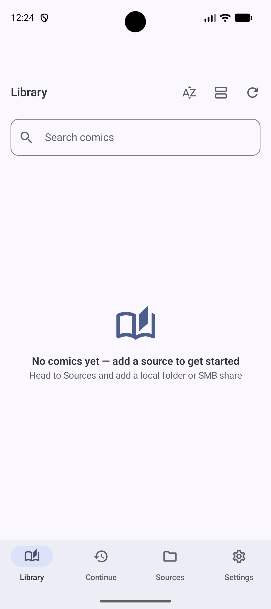
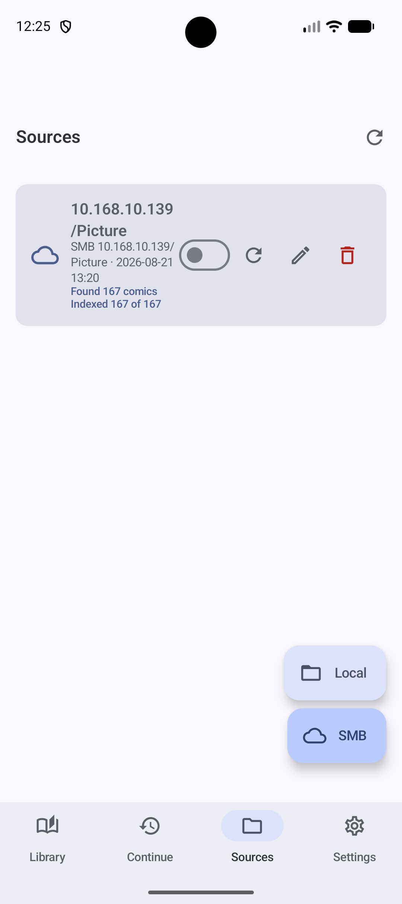
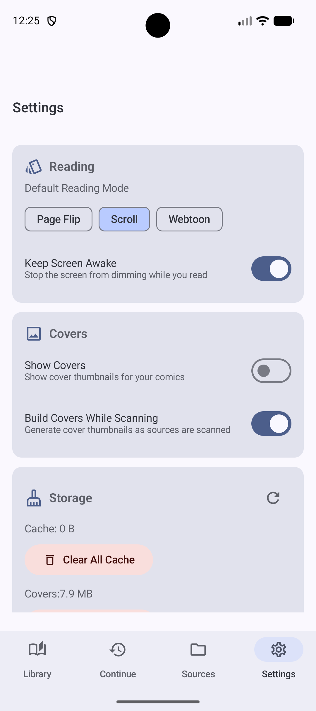

<div align="center">


<p align="center"><a href="./README.zh-CN.md">中文</a> | English<br></p>

# KaguyaCV (Kaguya Comics Viewer)

**An Android manga/comic reader for local folders and LAN SMB libraries**

`Kotlin` · `Jetpack Compose` · `Material 3` · `Android 10+`

</div>

---

## Screenshots

<p align="center">
  
  
  
</p>

<p align="center">
  <sub><b>Library</b></sub>
  &nbsp;&nbsp;&nbsp;&nbsp;&nbsp;&nbsp;&nbsp;&nbsp;&nbsp;&nbsp;&nbsp;&nbsp;&nbsp;&nbsp;&nbsp;&nbsp;&nbsp;&nbsp;&nbsp;&nbsp;
  <sub><b>Sources</b></sub>
  &nbsp;&nbsp;&nbsp;&nbsp;&nbsp;&nbsp;&nbsp;&nbsp;&nbsp;&nbsp;&nbsp;&nbsp;&nbsp;&nbsp;&nbsp;&nbsp;&nbsp;&nbsp;&nbsp;&nbsp;
  <sub><b>Settings</b></sub>
</p>

---

## Features

### Sources

- **Local folders**: grant access to a directory via the system file picker (SAF) and archives inside it are scanned recursively — no storage permission is requested.
- **SMB LAN shares**: enter host / share name / path / credentials (domain and custom port supported); you can **test the connection** and browse remote directories before adding.
- **Background indexing**: scanning runs in the background through a "keep-alive" foreground service plus WorkManager, with a progress notification that can be stopped at any time; the UI shows live `indexed x/y` progress.

### Reading

- **Three reading modes**: Paged (left/right), Continuous (vertical paging) and Webtoon (continuous scroll). Pick a default mode in Settings and switch temporarily while reading.
- **Page indicator & jump**: tap the page number to jump to any page.
- **Reading progress**: the position and completion state of every book are saved automatically; use "Continue Reading" on the home screen to resume.
- **Large image optimization**: oversized images are downsampled on demand into page thumbnails, so a full-size decode never blows up memory.

### Library

- Grid covers and list view, plus keyword search.
- Sort by **name / size / date added** × ascending / descending.
- Each book shows its cache state (pending / downloading / extracting / ready / failed) and its cache can be cleared individually.

### Appearance & personalization

- Themes: follow system / force dark / Android 12+ dynamic color (Material You).
- Languages: **简体中文 / English / 日本語** (follows the system, or pick one manually).
- Privacy: optionally "hide recent task preview" to mask app content in the recents list.

### Caching

- Local sources **never copy the original archive**; single pages are extracted on demand straight from the SAF input stream, costing zero extra storage.
- SMB sources use a **download the whole archive → extract → read** strategy to avoid stuttering while streaming.
- The Settings page shows cache / cover usage and free space, with one-tap clearing of all caches or covers. Cleaning only removes app cache — your original files are never deleted.

---

## Supported Formats

| Type | Support |
| --- | --- |
| Archives | **ZIP / CBZ** (RAR / CBR are not supported; they are counted and skipped while scanning) |
| Images | PNG, JPG / JPEG, WEBP, GIF, BMP, AVIF, HEIC / HEIF |

> **Sub-directories** inside an archive are supported (e.g. collection-style books with `Chapter01/`, `Chapter02/`); entries are sorted by relative path and treated as continuous pages of one book.

---

## Quick Start

1. Open the **Sources** page and tap `+` to add one:
   - **Local**: pick the folder holding your comics and grant access;
   - **SMB**: fill in host, share name, user name and password (domain and port optional), run `Connect & List Paths` to test first, then save.
2. Tap **Scan** on the source card and wait for indexing to finish (it can run in the background).
3. Back on the **Library** page, tap a cover to start reading.

---

## Build

Requirements:

- JDK **17** or newer
- Android SDK, `compileSdk 37` / `minSdk 29` / `targetSdk 37`
- Gradle 8.x (Aliyun and Google mirrors are configured)

```bash
# Debug build
./gradlew assembleDebug

# Release build
./gradlew assembleRelease
```

On Windows use `gradlew.bat assembleDebug`.

---

## Tech Stack

| Area | Choice |
| --- | --- |
| Language / UI | Kotlin 2.1.20, Jetpack Compose (BOM 2024.12.01), Material 3 |
| Dependency injection | Hilt (incl. Hilt-Work) |
| Database | Room |
| Background work | WorkManager + foreground service |
| Image loading | Coil (GIF / SVG support) |
| Preferences | MMKV |
| SMB | jcifs-ng 2.1.10 |
| Archive extraction | libarchive (native Android lib), with JDK `ZipFile` / `ZipInputStream` fallback for ZIP |

---

## Project Structure

```
app/src/main/kotlin/com/kaguya/comicsviewer/
├── data/
│   ├── local/          Room entities / DAOs / database
│   ├── repository/     ComicRepository implementation
│   ├── prefs/          SettingsRepository (MMKV)
│   ├── cache/          PageImageCache, per-page image cache
│   └── source/         Scanners and extraction (archive/, smb/)
├── domain/
│   ├── model/          Comic, ComicSource, ReadingMode, ComicSortOrder, …
│   └── usecase/        ScanSource, DownloadComic, SaveProgress, …
├── ui/
│   ├── library/        Library / Continue reading
│   ├── sources/        Source management (local + SMB)
│   ├── reader/         Reader
│   ├── settings/       Settings
│   ├── components/     Shared components
│   └── theme/          Theme and color schemes
├── work/               DownloadComicWorker, ExtractComicWorker, IndexKeepAliveService
├── notification/       Notification helpers
├── di/                 Hilt modules
└── util/               Utilities (LocaleHelper, CacheDirectories, …)
```

---

## Permissions

The app requests only the permissions below and does **not** request `READ_EXTERNAL_STORAGE` / `MANAGE_EXTERNAL_STORAGE`:

- `INTERNET`, `ACCESS_NETWORK_STATE`, `ACCESS_LOCAL_NETWORK`: access SMB shares
- `FOREGROUND_SERVICE`, `FOREGROUND_SERVICE_DATA_SYNC`, `WAKE_LOCK`: background indexing and downloads
- `POST_NOTIFICATIONS`: show download / indexing progress

All local files are accessed through SAF (`ACTION_OPEN_DOCUMENT_TREE`) authorization.

---

## FAQ

**RAR/CBR files were scanned but won't open?**
Extraction currently supports ZIP / CBZ only; RAR / CBR are counted as "skipped" in the scan result. Convert them to ZIP/CBZ and scan again.

**SMB connection fails?**
Check that the host / share name are correct, that the device and the NAS are on the same LAN, and that user name, password and domain are right — always test with `Connect & List Paths` first. Some older devices require SMB1 (this project uses the SMB2 stack).
