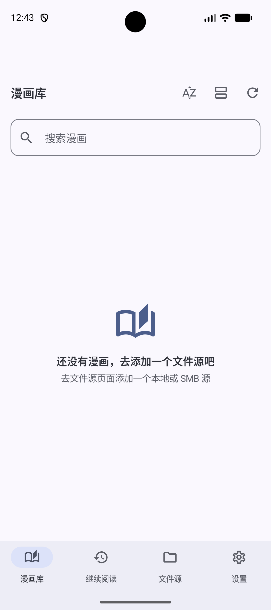
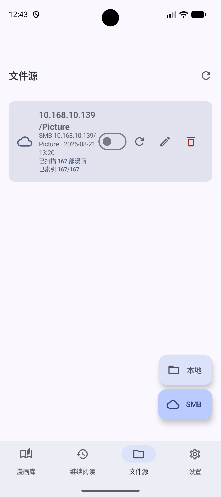
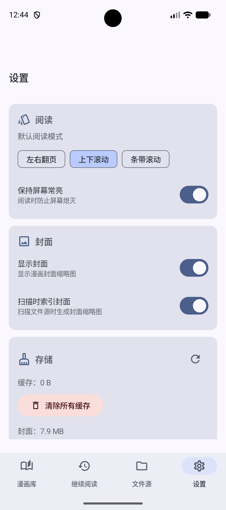

<div align="center">


<p align="center"><a href="./README.zh-CN.md">中文</a> | English<br></p>

# KaguyaCV（Kaguya Comics Viewer ）

**一款面向本地文件夹与局域网 SMB 漫画库的 Android 漫画阅读器**

`Kotlin` · `Jetpack Compose` · `Material 3` · `Android 10+`

</div>

---

## 截图

<p align="center">
  
  
  
</p>

<p align="center">
  <sub><b>漫画库</b></sub>
  &nbsp;&nbsp;&nbsp;&nbsp;&nbsp;&nbsp;&nbsp;&nbsp;&nbsp;&nbsp;&nbsp;&nbsp;&nbsp;&nbsp;&nbsp;&nbsp;&nbsp;&nbsp;&nbsp;&nbsp;
  <sub><b>数据源</b></sub>
  &nbsp;&nbsp;&nbsp;&nbsp;&nbsp;&nbsp;&nbsp;&nbsp;&nbsp;&nbsp;&nbsp;&nbsp;&nbsp;&nbsp;&nbsp;&nbsp;&nbsp;&nbsp;&nbsp;&nbsp;
  <sub><b>设置</b></sub>
</p>

---

## 功能特性

### 数据源

- **本地文件夹**：通过系统文件选择器（SAF）授权目录，递归扫描其中的漫画压缩包，不申请任何存储权限。
- **SMB 局域网共享**：填写主机 / 共享名 / 路径 / 账号密码（支持域名、自定义端口），添加前可一键**测试连接**并浏览远程目录。
- **后台索引**：扫描以「保持存活」的前台服务 + WorkManager 在后台执行，带进度通知，可随时停止；界面实时显示 `已索引 x/y`。

### 阅读

- **三种阅读模式**：左右翻页（Paged）、垂直翻页（Continuous）、条漫滚动（Webtoon），可在设置中选择默认模式，阅读中也可临时切换。
- **页码指示与跳页**：点击页码即可输入跳转到任意页。
- **阅读进度**：自动记录每本书的阅读位置与完成状态，首页「继续阅读」一键续读。
- **大图优化**：超大单图会按需降采样生成页缩略图，避免一次性解码整张原图导致内存暴涨。

### 漫画库

- 网格封面 + 列表视图切换、关键词搜索。
- 排序支持**名称 / 大小 / 加入时间** × 升 / 降序。
- 每本书显示缓存状态（等待 / 下载中 / 解压中 / 可读 / 失败）并可单独清理其缓存。

### 外观与个性化

- 主题：跟随系统 / 强制深色 / Android 12+ 动态取色（Material You）。
- 多语言：**简体中文 / English / 日本語**（跟随系统，也可手动指定）。
- 隐私：可开启「隐藏最近任务预览」，在最近任务列表中遮罩应用内容。

### 缓存

- 本地源**不复制原始压缩包**，直接通过 SAF 输入流按需解压单页，零额外占用。
- SMB 源采用「先下载整包 → 解压 → 阅读」的策略，避免边下边看卡顿。
- 设置页可查看缓存 / 封面占用与剩余空间，一键清理全部缓存或封面；清理只删 App 缓存，永远不会删除你的原始文件。

---

## 支持格式

| 类型 | 支持情况 |
| --- | --- |
| 压缩包 | **ZIP / CBZ**（RAR / CBR 暂不支持，扫描时会被统计并跳过） |
| 图片 | PNG、JPG / JPEG、WEBP、GIF、BMP、AVIF、HEIC / HEIF |

> 压缩包内支持**子目录**（如 `第01话/`、`第02话/` 的合集型漫画），会按相对路径排序后作为整本书的连续页面。

---

## 快速开始

1. 打开 **Sources（数据源）** 页，点击 `+` 添加：
   - **本地**：选择存放漫画的文件夹并授予访问权限；
   - **SMB**：填写主机、共享名、用户名、密码（可填域名与端口），先 `Connect & List Paths` 测试，再保存。
2. 在数据源卡片上点击 **Scan（扫描）**，等待索引完成（可后台进行）。
3. 回到 **Library（漫画库）**，点击封面即可开始阅读。

---

## 构建

环境要求：

- JDK **17** 及以上
- Android SDK，`compileSdk 37` / `minSdk 29` / `targetSdk 37`
- Gradle 8.x（仓库已配置阿里云与 Google 镜像）

```bash
# 调试包
./gradlew assembleDebug

# 发布包
./gradlew assembleRelease
```

Windows 下使用 `gradlew.bat assembleDebug`。

---

## 技术栈

| 领域 | 选型 |
| --- | --- |
| 语言 / UI | Kotlin 2.1.20、Jetpack Compose（BOM 2024.12.01）、Material 3 |
| 依赖注入 | Hilt（含 Hilt-Work） |
| 数据库 | Room |
| 后台任务 | WorkManager + 前台服务 |
| 图片加载 | Coil（GIF / SVG 支持） |
| 配置存储 | MMKV |
| SMB | jcifs-ng 2.1.10 |
| 压缩包解压 | libarchive（Android 原生库），ZIP 场景回退 JDK `ZipFile` / `ZipInputStream` |

---

## 项目结构

```
app/src/main/kotlin/com/kaguya/comicsviewer/
├── data/
│   ├── local/          Room Entity / Dao / Database
│   ├── repository/     ComicRepository 实现
│   ├── prefs/          SettingsRepository（MMKV）
│   ├── cache/          PageImageCache 页级图片缓存
│   └── source/         扫描器与解压（archive/、smb/）
├── domain/
│   ├── model/          Comic、ComicSource、ReadingMode、ComicSortOrder 等
│   └── usecase/        ScanSource、DownloadComic、SaveProgress 等
├── ui/
│   ├── library/        漫画库 / 继续阅读
│   ├── sources/        数据源管理（本地 + SMB）
│   ├── reader/         阅读器
│   ├── settings/       设置
│   ├── components/     通用组件
│   └── theme/          主题与配色
├── work/               DownloadComicWorker、ExtractComicWorker、IndexKeepAliveService
├── notification/       通知封装
├── di/                 Hilt 模块
└── util/               工具（LocaleHelper、CacheDirectories 等）
```

---

## 权限说明

应用仅申请以下权限，**不申请** `READ_EXTERNAL_STORAGE` / `MANAGE_EXTERNAL_STORAGE`：

- `INTERNET`、`ACCESS_NETWORK_STATE`、`ACCESS_LOCAL_NETWORK`：访问 SMB 共享
- `FOREGROUND_SERVICE`、`FOREGROUND_SERVICE_DATA_SYNC`、`WAKE_LOCK`：后台索引与下载
- `POST_NOTIFICATIONS`：显示下载 / 索引进度通知

本地文件全部通过 SAF（`ACTION_OPEN_DOCUMENT_TREE`）授权访问。

---

## 常见问题

**扫描到了 RAR/CBR 但无法打开？**
目前解压仅支持 ZIP / CBZ，RAR / CBR 会在扫描结果中被统计为「已跳过」。请转换为 ZIP/CBZ 后再扫描。

**SMB 连接失败？**
请确认主机 / 共享名正确、设备与 NAS 处于同一局域网、账号密码与域名填写无误，并先用 `Connect & List Paths` 测试连接；部分旧设备需要开启 SMB1（本项目使用 SMB2 协议栈）。
